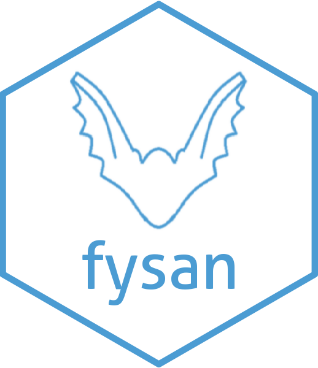

# fysan: Batch send filetypes via Outlook email, e.g. email all *.jpg* files in a specific folder via email 

**Author:** [Harry Ahlas](http://harry.ahlas.com)

**License:** [MIT](https://opensource.org/licenses/MIT)

- [x] *fyleIdentifier()* - list files in a directory of a certain type
- [x] *fyleSender()* - email files with multiple attachments
- [x] *fysan()* - email files in batches with patient iterations and create log
